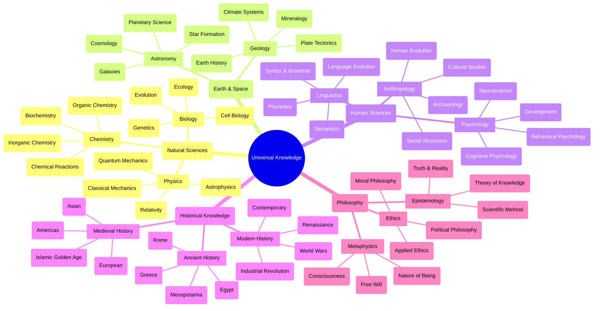

# Universal Knowledge Framework

## Core Knowledge Domains Mind Map



## Learning Approach

### 1. Foundation Building
- **Basic Principles**
  - Core concepts in each field
  - Fundamental theories
  - Key terminology
  - Historical context

- **Cross-Disciplinary Connections**
  - Identifying overlaps
  - Common themes
  - Unified theories
  - Interdisciplinary applications

### 2. Knowledge Areas (By Complexity)

#### Level 1: Foundational Understanding
1. **Basic Sciences**
   - Matter and energy
   - Life processes
   - Earth systems
   - Universal laws

2. **Historical Context**
   - Timeline understanding
   - Major civilizations
   - Cultural developments
   - Key events

3. **Human Understanding**
   - Basic psychology
   - Language fundamentals
   - Social structures
   - Philosophical concepts

#### Level 2: Advanced Concepts
1. **Complex Systems**
   - Quantum mechanics
   - Evolutionary biology
   - Climate systems
   - Neural networks

2. **Abstract Thinking**
   - Philosophical theories
   - Mathematical concepts
   - Theoretical physics
   - Cognitive science

### 3. Learning Methods

#### Active Learning
- Reading diverse sources
- Video lectures
- Interactive experiments
- Virtual simulations
- Documentary analysis

#### Knowledge Integration
- Cross-referencing
- Pattern recognition
- Theory connection
- Historical context

#### Discussion & Debate
- Topic exploration
- Idea challenging
- Perspective sharing
- Knowledge synthesis

### 4. Resource Organization

#### Digital Library
- **Books & Papers**
  - Scientific journals
  - Historical texts
  - Philosophy works
  - Modern research

- **Multimedia**
  - Documentaries
  - Lectures
  - Podcasts
  - Interactive content

- **Online Courses**
  - University courses
  - Specialized programs
  - Expert lectures
  - Workshop recordings

### 5. Learning Schedule

#### Daily Practice
- 1 hour reading
- 30 min reflection
- Note-taking
- Connection mapping

#### Weekly Focus
- Deep dive topics
- Cross-discipline exploration
- Knowledge synthesis
- Progress review

#### Monthly Themes
- Subject focus
- Integration practice
- Knowledge testing
- Resource gathering

## Knowledge Tracking

### Progress Matrix
- Topic understanding
- Concept connections
- Application ability
- Teaching capability

### Learning Journal
```markdown
## Entry: [Date]

### Today's Focus
- Topic:
- Resources:
- Key Insights:
- Questions:

### Connections Made
- Link to previous knowledge:
- Cross-disciplinary insights:
- New questions raised:

### Next Steps
- Areas to explore:
- Resources to find:
- Concepts to clarify:
```

## Study Methods

### Deep Learning
- Primary source reading
- Expert lectures
- Practical experiments
- Theory analysis

### Broad Learning
- Overview courses
- Summary materials
- Quick references
- Connection mapping

### Integration
- Cross-referencing
- Pattern recognition
- Theory synthesis
- Application finding

## Success Indicators

### Knowledge Depth
- Concept explanation
- Problem-solving
- Theory connection
- Knowledge application

### Understanding Breadth
- Field coverage
- Connection making
- Pattern recognition
- Synthesis ability

### Communication
- Concept teaching
- Idea discussion
- Knowledge sharing
- Question answering

## Action Plan

### Immediate Steps
1. Choose initial focus area
2. Gather basic resources
3. Set up learning system
4. Begin daily practice

### Weekly Goals
- Topic deep dive
- Resource review
- Connection mapping
- Progress check

### Monthly Review
- Knowledge assessment
- Resource evaluation
- Direction adjustment
- Next focus planning

## Notes
[Space for ongoing observations, insights, and learning patterns]

Last Updated: [Date] 